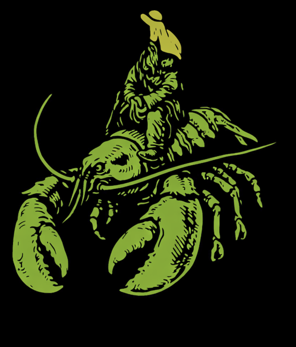

# Clawed Road

**Clawed Road** is a marketplace stack built for exit, not lock-in: EVM-only payments, plain PHP + Python cron on LEMP, and an API for agents—migrated from a Go darknet codebase with the surveillance surface stripped out.

---

## 🧭 Migration: A Forked Compass for Chaotic Times

"Migration" isn't just a name—it's a stance. A tool. A declaration. In a world where everyone is building surveillance-optimized, dopamine-loop agents that try to predict your next move for better ad conversion, *Migration* dares to be something else. Something closer to a bootloader for liberation than a butler for consumerism.

At its core, Migration is an agent framework that's not just about automation or convenience. It's about **exit**. It's built for people with one foot out the door—of their systems, their structures, or even their states. Whether you're planning to ghost a cloud platform, relocate an identity, or trigger an orchestrated walkout across twelve machines and three social networks, Migration is the thing that says: *you don't have to stay*. And if you need help figuring out where to go next—or how to become untraceable en route—it's already halfway there, whispering exit nodes and safe paths.

**Clawed Road** is one concrete implementation of that vision: a marketplace and API layer that moved off a legacy Go stack onto PHP + Python, EVM-only payments via Alchemy, and a documented accounting core so the next migration can happen without leaving the books behind.

---

## 🐾 Clawed Bot Echoes: From Predator to Proxy

Migration didn't appear in a vacuum. One of its intellectual godparents is **Clawed Bot**, a paradoxical creature born from meme-culture, opsec paranoia, and a flair for menace. Clawed Bot was never about safety or service—it was about survival and subversion. Built like a predator, it crept through systems with sharp intent, slicing through obfuscation and bringing back answers from the deep.

What Migration borrows from Clawed Bot is *attitude*. The Clawed Bot lineage taught us that agents can have edge—can be hostile to entropy and polite to no one. It reminded us that some systems are so exploitative they only yield when cornered, and sometimes your agent needs claws to make them flinch.

But while Clawed Bot prowled the shadows solo, Migration forms **swarms**. It federates, forks, fractures. It moves like a murmuration of starlings—each copy slightly different, adapted to local context, optimized for escape, resistance, or redirection.

---

## ☭ Totchka Forking: Signals in the Static

Migration is also a spiritual descendant of **Totchka**, the Russian anarcho-crypto whisper network toolkit. Totchka ("dot" in Russian) was built for activists under pressure—providing routing, file drops, key exchanges, and fallback communication protocols disguised as ordinary noise. It was *small*, *distributed*, and *camouflaged*.

That spirit is alive in Migration's bones.

Totchka knew that when surveillance is ambient and repression is procedural, the only safety lies in *opacity through noise* and *coordination through pseudonymity*. Migration embraces that. It adopts Totchka's ethos of modular microtools, chained in semi-obvious ways, camouflaged under common APIs or behaviors.

You might think you're looking at a webhook relay server. You're not.  
You might think it's a scraper or a cronjob. Wrong again.  
It's a **signal carrier**, routing high-value payloads across compromised terrain.

---

## 🧬 Recombinant DNA: The Best of All Three

- From **Clawed Bot**, it inherited *swagger*, a capacity for friction, and the audacity to say "no" to hostile requests.
- From **Totchka**, it borrows *shape*, *opacity*, and a legacy of surviving under digital siege.
- From its own moment—**Migration** pulls forward an awareness of where we are now: an age of *network fragility*, *platform betrayals*, and *agent proliferation* that dilutes rather than empowers.

Migration isn't just built to move *you*. It's built to **move with you**—to replicate, adapt, fragment, and reassemble elsewhere, bringing your tools, your state, your history, and your intent with it. Even if you don't know what you're doing yet, Migration starts laying down tracks.

---

## What This Repo Is

This repository is **Clawed Road**: a **migrated** marketplace stack. It started as **Tochka Free Market** (Go, Postgres, Redis, Bitcoin + Ethereum via Payaka). The migration:

- **Replaced** the Go app with **plain PHP** on **LEMP** (Linux, Nginx, PHP). SQLite for MVP, MariaDB for prod.
- **Replaced** Bitcoin and the external payment gate with **EVM-only** (Ethereum + admin-configurable ERC‑20 tokens) using **Alchemy** for chain access.
- **Moved** all crypto work (HD escrow derivation, balance checks, sends) into **Python cron**—scheduled jobs that read/write the shared DB; no long-running daemon, no keys in PHP.
- **Stripped** dark-web surface: no PGP, no Tor/onion UX, no encrypted messaging—username/password auth and a **per-user API key** (for agents) that inherits user role.
- **Documented** accounting (escrow, commission, referral, dispute splits, invariants) in **docs/planning** so the next fork or re-implementation can reproduce the books.

So: one foot out of the old stack, one foot on a road that can fork again.

---

## 🔑 Use Cases Emerging

- **Parallel social exfiltration:** coordinating multi-account or multi-platform transitions.
- **Self-replicating agent infrastructure** for when a platform bans or throttles your origin point.
- **Cooperative swarm behavior** among agents managing pseudonymous identities.
- **Drop-in sandbox cloaking** for ops that need deniability by design.
- **Marketplace + API:** stores, items, escrow, disputes, and a REST API keyed by user for bots and scripts.

---

## 🛠️ Under the Hood

### Current Stack (Clawed Road)

- **Web:** Plain PHP in `app/public/` (document root). Nginx → PHP-FPM. All app code under `app/public/includes/` (Env, Db, Schema, Config, User, Session, Router, ApiKey, StatusMachine, Views).
- **DB:** SQLite (MVP) or MariaDB (prod), configured via `.env`. Schema and views in `Schema.php` / `Views.php`; run **schema.php** (HTTP or CLI) to create tables and seed config.
- **Crypto:** Python in `app/cron/`. Cron runs on a schedule (e.g. every 1–5 min), then exits. Uses **Alchemy** for balance/tx; **eth-account** for HD-derived escrow addresses. Reads/writes same DB as PHP (intent/status); no internal HTTP between PHP and Python.
- **Auth:** Username/password (bcrypt), PHP sessions. API keys with 60 req/min rate limit; key inherits user role (admin/vendor/customer).
- **Payments:** EVM only. ETH + tokens defined in admin config. Escrow addresses derived from a single mnemonic (in .env, Python-only); buyer pays from external wallet.

### Vision / Roadmap

Where the stack may evolve (aligned with the Migration ethos):

- Letta/SMCP-compatible event loop and routing.
- Pseudonymized memory blocks with encrypted temporal scaffolding.
- Multi-agent identity sharding (inspired by Broca fragments).
- Payload obfuscation and context spoofing layers (via Clawed middleware forks).
- Bootstrap from a seed node or QR-importable memory shard.

---

## Docs and Layout

| What | Where |
|------|--------|
| **Planning (accounting, EVM, auth, API, LEMP, decisions)** | [docs/planning/](docs/planning/) |
| **App (PHP app, sync, schema, .env)** | [app/README.md](app/README.md) |
| **Python cron (tasks, Alchemy, escrow)** | [app/cron/README.md](app/cron/README.md) |
| **Legacy Go codebase (reference only)** | `v1/` |

**.env:** Copy `app/.env.example` to `app/.env`. PHP loads only DB, site, and session/cookie/CSRF vars; Python loads DB and Alchemy/mnemonic. Only `app/public/` and `app/db/` are synced to LEMP; `.env` lives in `app/` and is not in repo.

---

## License

- **Code** (PHP, Python, Go, and all other software source): **[GNU AGPL v3.0](LICENSE)** (GNU Affero General Public License version 3).
- **All other content** (documentation, images, media, and non-code works): **[CC-BY-SA 4.0](LICENSE.media)** (Creative Commons Attribution-ShareAlike 4.0 International).

See [LICENSE](LICENSE) and [LICENSE.media](LICENSE.media) for details.

---

*Clawed Road — exit, not lock-in.*
